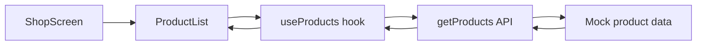
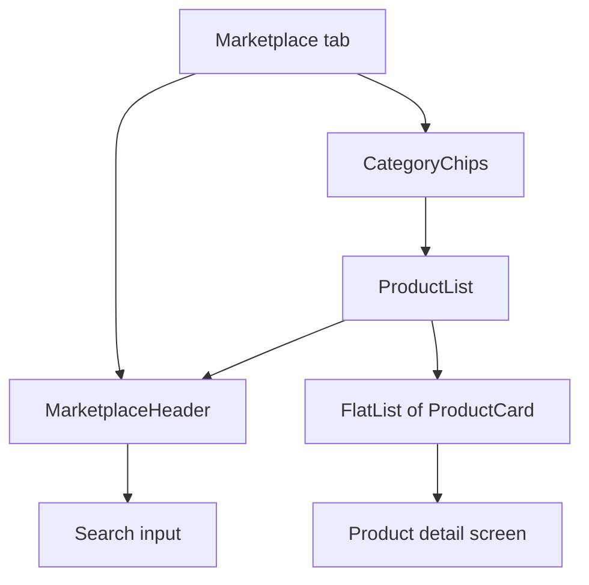
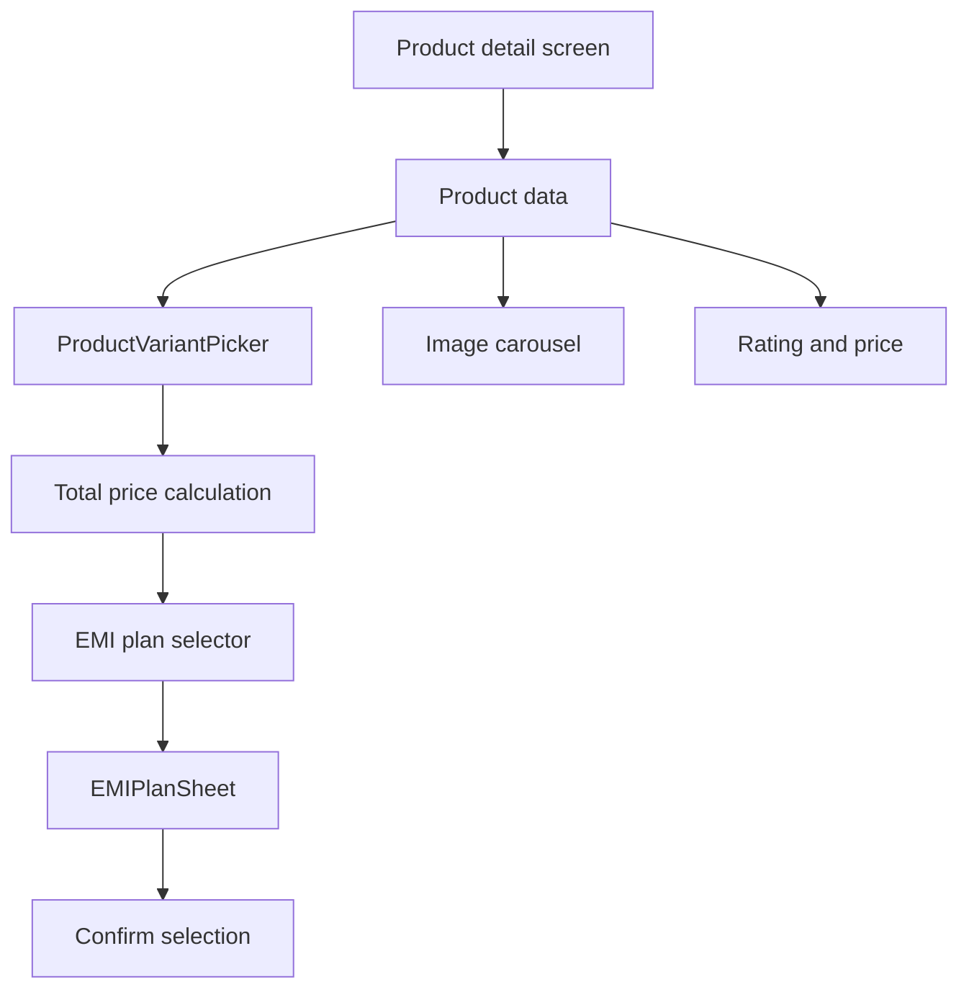
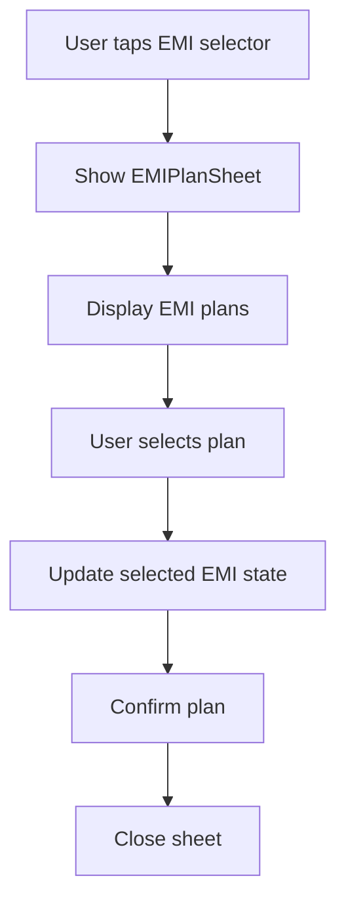
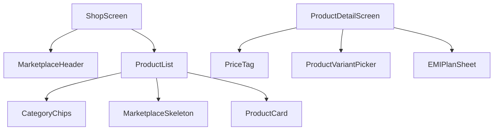

# 1fi-app

A React Native app built with Expo Router. This repository contains the marketplace experience for shopping products with no-cost EMI plans.

## Getting Started

Install dependencies

```bash
npm install
```

Run the app

```bash
npx expo start
```

Platform commands

```bash
npx expo start --android
npx expo start --ios
npx expo start --web
```

## Project Structure

```
app/
  (tabs)/        - Tab navigation shell and tab screens
  product/[id].tsx - Product detail screen
  _layout.tsx    - Root stack layout
src/
  api/           - Marketplace API layer
  hooks/         - Marketplace state hooks
  components/marketplace/ - Marketplace UI components
  data/          - Mock categories and products
  types/         - TypeScript interfaces
```

## Marketplace Overview

The marketplace lets users browse products by category, search results, pick variants, choose an EMI plan, and confirm a purchase. The experience is split across:

- Shop home with tabs for brands, nearby stores, and marketplace
- Marketplace list with category chips and product cards
- Product detail with variant and EMI selection
- EMI plan sheet for plan selection

### Marketplace Data Flow



### Product Listing Flow



### Product Detail Flow



### EMI Selection Flow



### Component Layout



## Features

- Category browsing with chips for Electronics, Travel, Jewellery, and Home
- Search across product name, brand, and description
- Product variant selection by color, storage, and size
- No-cost EMI plan selection with monthly payment and total cost
- Product detail with specs and ratings
- Mock data layer with a simulated delay for realistic loading states

## Tech Stack

- Expo
- React Native
- Expo Router
- TypeScript

## Environment

No environment variables are required for the current mock setup.

## Mock Data

Categories and products are sourced from `src/data/mock-products.ts`. The API layer in `src/api/marketplace.ts` adds a short simulated delay and supports category and search filtering.

## Current Scope

This codebase is focused on the marketplace browsing and EMI selection flow. Purchase finalization and backend integration are not included in the current screens.

## Notes

- All prices are formatted for the Indian market using the rupee symbol.
- EMI plans in the mock data use no-cost EMIs with zero interest.
- Product variants can increase or decrease the final price.
